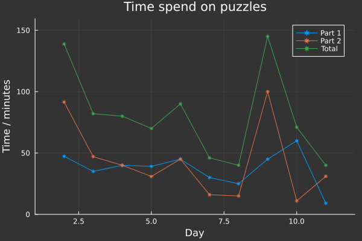
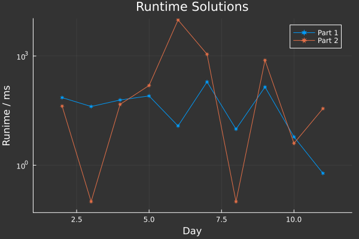

# AdventOfCode2024
🎅 Advent of Code 2024 🎅 🎄✨🎄 This year in: Julia 🎄✨🎄

After 4 years of rustvent, I want to learn something new! And I heart Julia is the cool stuff right now ;)

## Times
The times include the time reading the puzzle and coding the solution. 

(Below 100 ms runtime of code is probably spend on JIT compilation of Julia)
